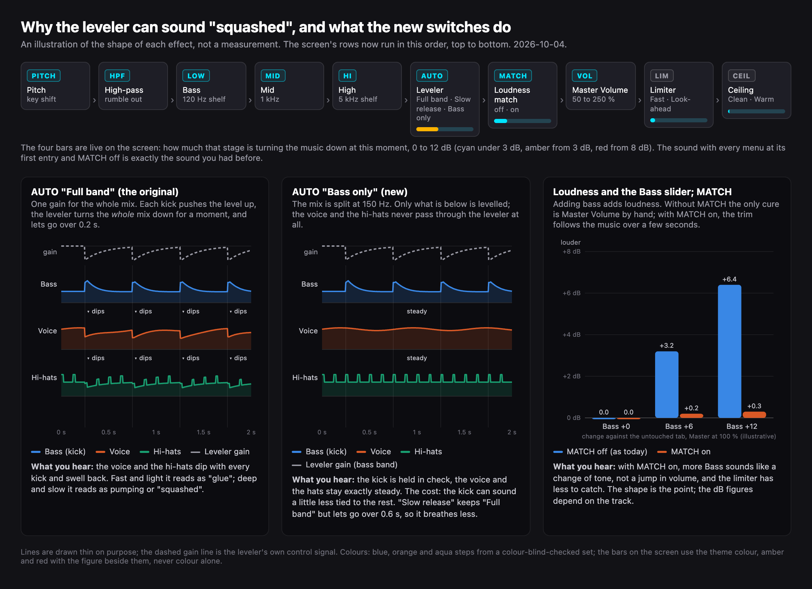

# The listening check (S-04): what to listen for, how the chain handles loud bass, and the alternatives

Written 2026-10-03 at your request ("tell me more about what good is here and what bad is, how it works, why I do or don't want that sound, how the EQ is set up to address it, pros and cons, alternatives"). The harness proves the output never exceeds −0.3 dBFS at the worst settings; it cannot tell whether the way it stays under sounds good on music. Only your ears can.

**Update 2026-10-04 (1.5.0, decision D-01).** You reported hearing both cases ("more bass and other times squashed") and asked for the alternatives to be built as switches in the app with the current sound preserved. They are. Every alternative is a menu entry or a tag on the screen; the first entry of every menu, with MATCH off, is exactly the sound you had before (the harness proves the default path reproduces six measurements taken on 1.4.0: W-DYN-BASELINE). Each dynamics row also shows a live bar, how much that stage is turning the music down right now. The diagram below is the explanation you asked for ("explain visually with diagram").

## The switches (1.5.0)

| Row | Tag or menu | Entries | What each one is |
|---|---|---|---|
| Leveler (the AUTO row) | menu | **Full band** · Slow release · Bass only | Full band: the original (Chrome's compressor: threshold −18 dBFS, knee 20 dB, 3.5:1, attack 10 ms, release 200 ms; it also lifts the level a little, about +3 dB on a quiet signal, measured). Slow release: the same compressor letting go over 600 ms instead of 200 ms, so it breathes less between kicks and recovers more slowly after a loud passage. Bass only: a separate leveler that acts only below 150 Hz (the mix is split with a Linkwitz-Riley crossover; threshold −20 dBFS RMS, knee 20 dB, 3.5:1, attack 10 ms, release 200 ms, no lift); voice and hi-hats never pass through it. |
| Loudness match (MATCH row) | tag | off · on | On: the level is trimmed automatically so the processed music is as loud as the untouched tab, measured the way streaming services measure loudness (ITU-R BS.1770 K-weighting) over about three seconds; the trim moves slowly (0.4 s) and stays within −14 to +6 dB. You hear tone, not loudness; AUTO's lift disappears too, which makes AUTO on and off a fair comparison. Master Volume still adds on top. |
| Limiter (LIM row) | menu | **Fast** · Look-ahead | Fast: the original (threshold −0.3 dBFS, 20:1, attack 1 ms, release 50 ms; the fastest peaks slip past to the ceiling). Look-ahead: the audio is delayed 5 ms and the gain is lowered smoothly before each peak arrives, so no sample ever passes 0.93 (−0.63 dBFS) and the ceiling has nothing to do. Measured at the worst settings, its distortion products are 25 to 40 dB lower than Fast's. Adds 5 ms of delay only while selected. |
| Ceiling (CEIL row) | menu | **Clean** · Warm | Clean: the original (nothing below −0.63 dBFS, a bend to −0.3 dBFS above). Warm: a soft clip (0.966·tanh) that rounds the loudest peaks gradually from about −10 dBFS up, like tape; a deliberate, gentle distortion, 4× oversampled to keep it clean. Still never above −0.3 dBFS. |

Bold = the default = the 1.4.0 sound. The modes are engine settings, not preset values: switching presets does not change them, so you can compare a mode across presets. They persist.

**How to compare.** Pick the heaviest preset you use, play a track with a kick, a voice and hi-hats. 1) Watch the AUTO bar during the loud part: steady amber or red is the leveler working hard. 2) Switch Leveler to Bass only; the voice and the hats should stop dipping with the kick; then try Slow release. 3) Switch MATCH on and leave it on while comparing anything else, so loudness stops fooling you. 4) At high Master settings, switch Limiter to Look-ahead and listen to the kick's attack; then Ceiling to Warm. Report in the same words as before: which switch, which preset, which track, roughly when, and which row of the table it sounded like.

## Why there is a check at all

A bass boost of +8 dB with Master Volume at 250 % asks for far more level than digital audio can hold (0 dBFS is the ceiling of the format and of your DAC). Something has to give. Either the tops of the waveform are cut off (distortion), or something turns the level down in time (a compressor or limiter), and turning down in time has its own sound (pumping). The chain is built so that the second thing happens, gently, and the first never does. The check is: does that work on real music at your volume, or can you hear the mechanism?

## Good and bad, in words

| What you hear | What it is | Where it comes from |
|---|---|---|
| Crackle, fizz or buzz riding on bass notes; kick drums turning into clicks; cymbals turning splashy | **Distortion** (clipping): the waveform's tops are flattened, which adds harmonics that were not in the music | Inside the extension only the final ceiling can do this, and only when driven hard and continuously. More often it is the speakers or headphones themselves being overdriven by the extra bass at a high system volume (the extension cannot exceed −0.3 dBFS, but a small speaker can still be pushed past its mechanical limit). The volume knob is the fix for that one. |
| After each kick the whole track dips for a moment and swells back; hi-hats or the voice duck when the bass hits | **Pumping** (breathing): a compressor or limiter turning the level down on the loud hit and letting go slowly | The Auto-Balancing leveler (release 200 ms) on dense, heavy bass; or the safety limiter (release 50 ms) if the Master Volume keeps it working all the time |
| No punch; loud and quiet parts the same; tiring after a while | **Over-compression**: too much level control | The same two stages, working too hard |
| Bass smears into the vocals; the low end is boomy rather than deep | **Mud**: too much energy between about 100 and 250 Hz | A big boost with the shelf at 120 Hz, or an HPF set very low on a boomy recording |
| Bass bigger and deeper, the kick still hits cleanly, voice and hats steady, and flipping AUDIO EQ off and on sounds like "more bass", not "squashed" | **Good** | What the chain is meant to do |

## How the chain is set up (signal order)

1. **HPF** (high-pass, 20 to 200 Hz, 12 dB per octave). Removes what is below the cutoff: rumble and sub-sonic content most speakers cannot reproduce. This is headroom: the boost and the limiter are not spent on sound you cannot hear.
2. **Bass** (low shelf at 120 Hz), **Mid** (peak at 1 kHz, Q 0.8), **High** (shelf at 5 kHz). The tone controls.
3. **Auto-Balancing** (the AUTO switch): a compressor with threshold −18 dBFS, a soft knee of 20 dB, ratio 3.5 : 1, attack 10 ms, release 200 ms. When the boosted signal rises above about −18 dBFS it is turned down progressively, so a heavy preset can be loud without the safety limiter working constantly. It is the stage that can pump.
4. **Master Volume** (50 to 250 %).
5. **Safety limiter**: threshold −0.3 dBFS, no knee, ratio 20 : 1, attack 1 ms, release 50 ms. Catches peaks that still get through.
6. **Ceiling**: a soft clip that bends anything above −0.63 dBFS toward −0.3 dBFS and never beyond. It exists because the limiter's 1 ms attack lets fast peaks overshoot (measured +0.2 dB at extreme settings). Below −0.63 dBFS it does nothing at all.

Pitch (the 1.4.0 key shift) sits before the HPF and is routed around at 0 st; it is not part of the loudness story.

## Why you might want this, and why not

- **For**: heavy presets stay listenable at any Master setting; nothing can clip your DAC; at moderate settings the chain is transparent (the harness shows flat settings pass a tone at its exact input level).
- **Against**: the leveler is broadband, so when the bass hits it turns *everything* down a little, not just the bass (1.5.0: Leveler → Bass only); its release is fixed at 200 ms (1.5.0: Slow release); the limiter has no look-ahead, so it leans on the ceiling for the last fraction of a dB (1.5.0: Limiter → Look-ahead); and there is no gain compensation, so more bass means more loudness until you turn Master down by hand (1.5.0: MATCH).

## Things to try now (no code)

Kept at your request of 2026-10-04 ("let's remember that note"). With MATCH on, item 3 happens by itself.

1. **AUTO off, Master at 100 % or below.** Punchier; the limiter and the ceiling alone keep you safe. If it still sounds clean, you may not want the leveler at all for that preset.
2. **HPF from 30 up to 40 Hz on the heavy presets.** Tighter bass, more headroom, less work for the leveler. Most music has nothing useful below 40 Hz.
3. **Turn Master down as you turn Bass up.** Roughly: every +6 dB of bass, take Master to about 70 %. Then nothing limits at all and the boost is pure tone, not loudness.
4. **Compare "Deep Sub-Bass" with "Clean DJ (Anti-Distortion)"** on the same track. The second is built around headroom (HPF 35, bass +4.5); the difference you hear is the trade-off in this document.

## Alternatives in the design (your call of 2026-10-04: built as switches, see the table at the top)

| Option | What it does | Pro | Con | 1.5.0 |
|---|---|---|---|---|
| Slower leveler release | Let go in 600 ms instead of 200 ms | Less pumping on dense bass | Slower recovery after a loud passage | Leveler → Slow release |
| Bass-only (multiband) leveler | Level only below 150 Hz | Voice and hats never duck; the usual design for bass boosters | The kick can sound a little less tied to the rest | Leveler → Bass only |
| Automatic gain compensation | Keep the loudness where the untouched tab had it | You hear tone, not loudness; the limiter rests | The trim follows the music over a few seconds (section changes can be heard as a slow level change) | MATCH tag |
| Look-ahead limiter | See peaks 5 ms early and turn down before them | Cleaner peaks, nothing left for the ceiling | 5 ms of delay while selected | Limiter → Look-ahead |
| Gentle saturation instead of a hard ceiling | Round the loudest peaks deliberately | Some like the warmth on bass | It is distortion by design; not transparent | Ceiling → Warm |
| True-peak (oversampled) ceiling | Catch peaks that appear between samples in the DAC | Safer on some DACs | Extra CPU for a case the measurements have not shown | not built |

Guide: pumping points to Bass only or Slow release; fizz at peaks to Look-ahead; "simply too loud" to MATCH. The bars tell you which stage was working when you heard it.

## How to run the check

1. Pick the heaviest preset you use ("Deep Sub-Bass (Dub/Trap)" or "Club / Festival Bangers"), or push Bass to +14 dB and Master to 200 %.
2. Play a bass-heavy track you know well, at the volume you normally use, for a minute. Then a track with a clear voice and hi-hats.
3. Listen for the table above. Flip the AUTO switch off and on while a loud passage plays; flip AUDIO EQ off and on.
4. Report one of: "clean"; or the preset, the track, roughly when, and which row of the table it sounded like.
